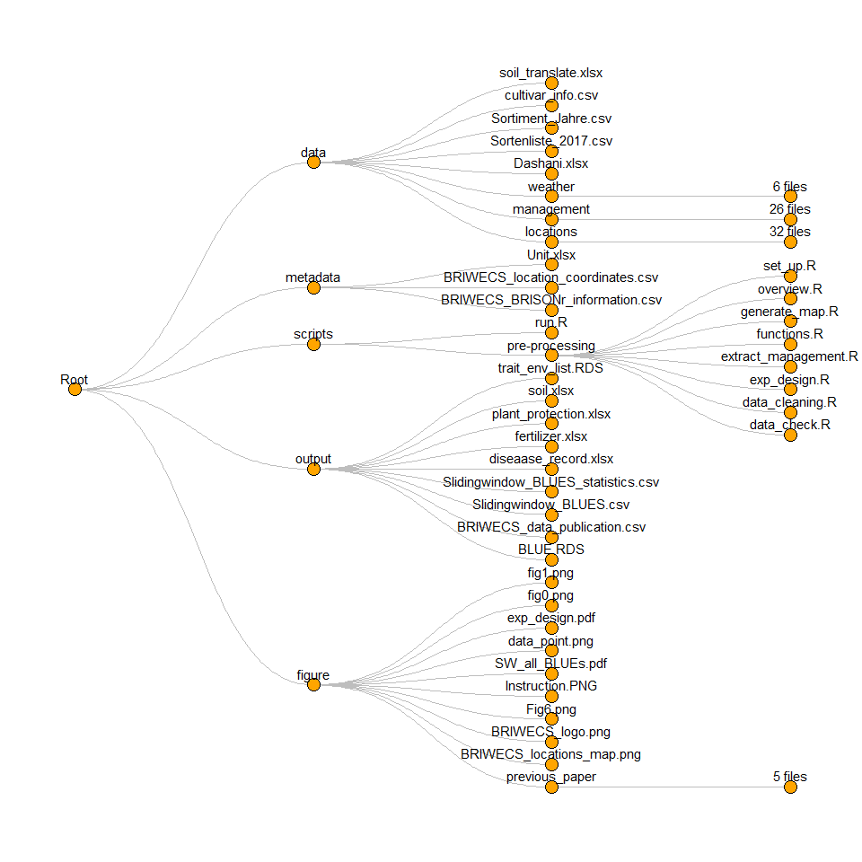

<!-- README.md is generated from README.Rmd. Please edit that file -->

# BRIWECS_Data_Publication

## A collaborative work on a data publication for the seasons 2015–2019 of the BRIWECS consortium

<!--  -->

## insturctution

1.  open `BRIWECS_Data_Publication.RProject`
2.  open `scripts/run.R`
3.  run all `Ctrl + Alt + R` 

## directory tree

<!-- -->

## unit table

<table class=" lightable-classic-2" style="font-family: &quot;Arial Narrow&quot;, &quot;Source Sans Pro&quot;, sans-serif; width: auto !important; float: right; margin-left: 10px;">
<caption>
Table1. trait name, range and unit
</caption>
<thead>
<tr>
<th style="text-align:left;">
trait name
</th>
<th style="text-align:left;">
full name
</th>
<th style="text-align:left;">
trait range
</th>
<th style="text-align:left;">
unit
</th>
</tr>
</thead>
<tbody>
<tr>
<td style="text-align:left;">
BBCH59
</td>
<td style="text-align:left;">
Day when 75% of the ears are visible
</td>
<td style="text-align:left;">
123~181
</td>
<td style="text-align:left;">
days of year
</td>
</tr>
<tr>
<td style="text-align:left;">
BBCH87
</td>
<td style="text-align:left;">
Day when 75% hard dough
</td>
<td style="text-align:left;">
175~213
</td>
<td style="text-align:left;">
days of year
</td>
</tr>
<tr>
<td style="text-align:left;">
Biomass
</td>
<td style="text-align:left;">
Above-ground dry biomass of whole plot
</td>
<td style="text-align:left;">
14.2~856
</td>
<td style="text-align:left;">
dt/ha
</td>
</tr>
<tr>
<td style="text-align:left;">
Biomass_bio
</td>
<td style="text-align:left;">
Above-ground dry biomass of 50 cm cut
</td>
<td style="text-align:left;">
0~3495
</td>
<td style="text-align:left;">
g/m2
</td>
</tr>
<tr>
<td style="text-align:left;">
Crude_protein
</td>
<td style="text-align:left;">
Crude protein percentage per grain dry mass
</td>
<td style="text-align:left;">
6.2~21.3
</td>
<td style="text-align:left;">
%
</td>
</tr>
<tr>
<td style="text-align:left;">
DTR
</td>
<td style="text-align:left;">
Leaf tan spot caused by Drechslera tritici-repentis
</td>
<td style="text-align:left;">
0~100
</td>
<td style="text-align:left;">
% leaf area
</td>
</tr>
<tr>
<td style="text-align:left;">
Falling_number
</td>
<td style="text-align:left;">
Falling number
</td>
<td style="text-align:left;">
60~700
</td>
<td style="text-align:left;">
s
</td>
</tr>
<tr>
<td style="text-align:left;">
Fusarium
</td>
<td style="text-align:left;">
Fusarium head blight
</td>
<td style="text-align:left;">
0~27
</td>
<td style="text-align:left;">
% spike
</td>
</tr>
<tr>
<td style="text-align:left;">
Harvest_Index
</td>
<td style="text-align:left;">
Harvest index per plot
</td>
<td style="text-align:left;">
0.1~0.8
</td>
<td style="text-align:left;">
</td>
</tr>
<tr>
<td style="text-align:left;">
Kernel
</td>
<td style="text-align:left;">
Number of kernels per unit area of plot
</td>
<td style="text-align:left;">
19.2~5851.5
</td>
<td style="text-align:left;">
Nbr x 10^5/ha
</td>
</tr>
<tr>
<td style="text-align:left;">
KperSpike
</td>
<td style="text-align:left;">
Kernels per spike of 50 cm cut
</td>
<td style="text-align:left;">
3.6~146.7
</td>
<td style="text-align:left;">
Nbr
</td>
</tr>
<tr>
<td style="text-align:left;">
Leaf_rust
</td>
<td style="text-align:left;">
Leaf rust caused by Puccinia triticina Eriks.
</td>
<td style="text-align:left;">
0~90
</td>
<td style="text-align:left;">
% leaf area
</td>
</tr>
<tr>
<td style="text-align:left;">
Plantheight
</td>
<td style="text-align:left;">
Plant height of 50 cm cut
</td>
<td style="text-align:left;">
40~145
</td>
<td style="text-align:left;">
cm
</td>
</tr>
<tr>
<td style="text-align:left;">
Powdery_mildew
</td>
<td style="text-align:left;">
Leaf powdery mildew
</td>
<td style="text-align:left;">
0~100
</td>
<td style="text-align:left;">
% leaf area
</td>
</tr>
<tr>
<td style="text-align:left;">
Protein_yield
</td>
<td style="text-align:left;">
Grain protein yield per plot
</td>
<td style="text-align:left;">
0~22.2
</td>
<td style="text-align:left;">
dt/ha
</td>
</tr>
<tr>
<td style="text-align:left;">
Sedimentation
</td>
<td style="text-align:left;">
Sedimentation
</td>
<td style="text-align:left;">
2.1~95.4
</td>
<td style="text-align:left;">
ml
</td>
</tr>
<tr>
<td style="text-align:left;">
Seedyield
</td>
<td style="text-align:left;">
Grain yield per plot
</td>
<td style="text-align:left;">
0~141.6
</td>
<td style="text-align:left;">
dt/ha
</td>
</tr>
<tr>
<td style="text-align:left;">
Seedyield_bio
</td>
<td style="text-align:left;">
Grain yield of 50 cm cut
</td>
<td style="text-align:left;">
28.3~1815
</td>
<td style="text-align:left;">
g/m2
</td>
</tr>
<tr>
<td style="text-align:left;">
Septoria
</td>
<td style="text-align:left;">
Leaf spot caused by Septoria tritici
</td>
<td style="text-align:left;">
0~80
</td>
<td style="text-align:left;">
% leaf area
</td>
</tr>
<tr>
<td style="text-align:left;">
Spike_number
</td>
<td style="text-align:left;">
Spike number per 50 cm cut
</td>
<td style="text-align:left;">
48~1390
</td>
<td style="text-align:left;">
Nbr /m2
</td>
</tr>
<tr>
<td style="text-align:left;">
Straw
</td>
<td style="text-align:left;">
Above ground biomass substracted by grain yield
</td>
<td style="text-align:left;">
8.9~729.7
</td>
<td style="text-align:left;">
dt/ha
</td>
</tr>
<tr>
<td style="text-align:left;">
Stripe_rust
</td>
<td style="text-align:left;">
Stripe rust caused by Puccinia striiformis
</td>
<td style="text-align:left;">
0~100
</td>
<td style="text-align:left;">
% leaf area
</td>
</tr>
<tr>
<td style="text-align:left;">
TKW_bio
</td>
<td style="text-align:left;">
Thousand kernel weight of 50 cm cut
</td>
<td style="text-align:left;">
4.7~77.8
</td>
<td style="text-align:left;">
g
</td>
</tr>
<tr>
<td style="text-align:left;">
TKW_plot
</td>
<td style="text-align:left;">
Thousand kernel weight of whole plot
</td>
<td style="text-align:left;">
2.6~69.5
</td>
<td style="text-align:left;">
g
</td>
</tr>
</tbody>
</table>

## overview picture

