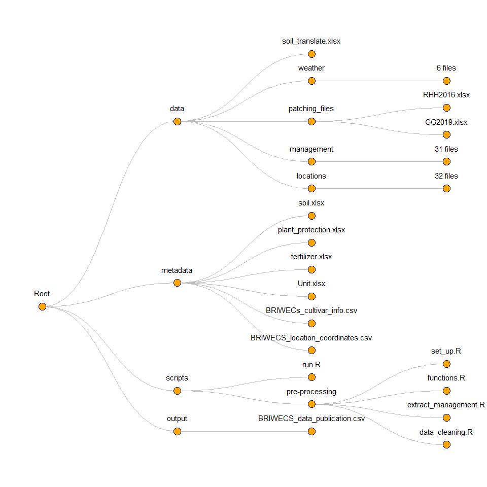

<!-- README.md is generated from README.Rmd. Please edit that file -->

# BRIWECS_Data_Publication

## A collaborative work on a data publication for the seasons 2015–2019 of the BRIWECS consortium

<!--  -->

## insturctution

1.  open `BRIWECS_Data_Publication.RProject`
2.  open `scripts/run.R`
3.  run all `Ctrl + Alt + R` 

## directory tree

<!-- -->

## trait table

<table class=" lightable-classic-2" style="font-family: &quot;Arial Narrow&quot;, &quot;Source Sans Pro&quot;, sans-serif; width: auto !important; float: right; margin-left: 10px;">
<caption>
Table 1. trait names, sources, ranges and units
</caption>
<thead>
<tr>
<th style="text-align:left;">
trait full name
</th>
<th style="text-align:left;">
trait name in data descriptor
</th>
<th style="text-align:left;">
sample source
</th>
<th style="text-align:left;">
trait range
</th>
<th style="text-align:left;">
unit
</th>
</tr>
</thead>
<tbody>
<tr>
<td style="text-align:left;">
harvest index
</td>
<td style="text-align:left;">
Harvest_Index_bio
</td>
<td style="text-align:left;">
biomass 50 cm cut
</td>
<td style="text-align:left;">
0.1~0.8
</td>
<td style="text-align:left;">
</td>
</tr>
<tr>
<td style="text-align:left;">
kernels per spike
</td>
<td style="text-align:left;">
KperSpike_bio
</td>
<td style="text-align:left;">
biomass 50 cm cut
</td>
<td style="text-align:left;">
3.6~146.7
</td>
<td style="text-align:left;">
Nbr
</td>
</tr>
<tr>
<td style="text-align:left;">
plant height
</td>
<td style="text-align:left;">
Plantheight_bio
</td>
<td style="text-align:left;">
biomass 50 cm cut
</td>
<td style="text-align:left;">
40~145
</td>
<td style="text-align:left;">
cm
</td>
</tr>
<tr>
<td style="text-align:left;">
spike number
</td>
<td style="text-align:left;">
Spike_number_bio
</td>
<td style="text-align:left;">
biomass 50 cm cut
</td>
<td style="text-align:left;">
48~1390
</td>
<td style="text-align:left;">
Nbr /m2
</td>
</tr>
<tr>
<td style="text-align:left;">
above-ground dry biomass
</td>
<td style="text-align:left;">
Biomass_bio,Biomass
</td>
<td style="text-align:left;">
biomass 50 cm cut,whole plot
</td>
<td style="text-align:left;">
0~3495
</td>
<td style="text-align:left;">
g/m2,dt/ha
</td>
</tr>
<tr>
<td style="text-align:left;">
day when 75% of the ears are visible
</td>
<td style="text-align:left;">
BBCH59
</td>
<td style="text-align:left;">
whole plot
</td>
<td style="text-align:left;">
123~181
</td>
<td style="text-align:left;">
days of year
</td>
</tr>
<tr>
<td style="text-align:left;">
day when 75% hard dough
</td>
<td style="text-align:left;">
BBCH87
</td>
<td style="text-align:left;">
whole plot
</td>
<td style="text-align:left;">
175~213
</td>
<td style="text-align:left;">
days of year
</td>
</tr>
<tr>
<td style="text-align:left;">
crude protein percentage per grain dry mass
</td>
<td style="text-align:left;">
Crude_protein
</td>
<td style="text-align:left;">
whole plot
</td>
<td style="text-align:left;">
6.2~21.3
</td>
<td style="text-align:left;">
%
</td>
</tr>
<tr>
<td style="text-align:left;">
leaf tan spot caused by Drechslera tritici-repentis
</td>
<td style="text-align:left;">
DTR
</td>
<td style="text-align:left;">
whole plot
</td>
<td style="text-align:left;">
0~100
</td>
<td style="text-align:left;">
% leaf area
</td>
</tr>
<tr>
<td style="text-align:left;">
falling number
</td>
<td style="text-align:left;">
Falling_number
</td>
<td style="text-align:left;">
whole plot
</td>
<td style="text-align:left;">
60~700
</td>
<td style="text-align:left;">
s
</td>
</tr>
<tr>
<td style="text-align:left;">
fusarium head blight
</td>
<td style="text-align:left;">
Fusarium
</td>
<td style="text-align:left;">
whole plot
</td>
<td style="text-align:left;">
0~27
</td>
<td style="text-align:left;">
% spike
</td>
</tr>
<tr>
<td style="text-align:left;">
number of kernels per unit area
</td>
<td style="text-align:left;">
Kernel
</td>
<td style="text-align:left;">
whole plot
</td>
<td style="text-align:left;">
19.2~5851.5
</td>
<td style="text-align:left;">
Nbr x 10^5/ha
</td>
</tr>
<tr>
<td style="text-align:left;">
leaf rust caused by Puccinia triticina eriks.
</td>
<td style="text-align:left;">
Leaf_rust
</td>
<td style="text-align:left;">
whole plot
</td>
<td style="text-align:left;">
0~90
</td>
<td style="text-align:left;">
% leaf area
</td>
</tr>
<tr>
<td style="text-align:left;">
leaf powdery mildew
</td>
<td style="text-align:left;">
Powdery_mildew
</td>
<td style="text-align:left;">
whole plot
</td>
<td style="text-align:left;">
0~100
</td>
<td style="text-align:left;">
% leaf area
</td>
</tr>
<tr>
<td style="text-align:left;">
grain protein yield
</td>
<td style="text-align:left;">
Protein_yield
</td>
<td style="text-align:left;">
whole plot
</td>
<td style="text-align:left;">
0~22.2
</td>
<td style="text-align:left;">
dt/ha
</td>
</tr>
<tr>
<td style="text-align:left;">
sedimentation
</td>
<td style="text-align:left;">
Sedimentation
</td>
<td style="text-align:left;">
whole plot
</td>
<td style="text-align:left;">
2.1~95.4
</td>
<td style="text-align:left;">
ml
</td>
</tr>
<tr>
<td style="text-align:left;">
leaf spot caused by Septoria tritici
</td>
<td style="text-align:left;">
Septoria
</td>
<td style="text-align:left;">
whole plot
</td>
<td style="text-align:left;">
0~80
</td>
<td style="text-align:left;">
% leaf area
</td>
</tr>
<tr>
<td style="text-align:left;">
above ground biomass substracted by grain yield
</td>
<td style="text-align:left;">
Straw
</td>
<td style="text-align:left;">
whole plot
</td>
<td style="text-align:left;">
8.9~729.7
</td>
<td style="text-align:left;">
dt/ha
</td>
</tr>
<tr>
<td style="text-align:left;">
stripe rust caused by Puccinia striiformis
</td>
<td style="text-align:left;">
Stripe_rust
</td>
<td style="text-align:left;">
whole plot
</td>
<td style="text-align:left;">
0~100
</td>
<td style="text-align:left;">
% leaf area
</td>
</tr>
<tr>
<td style="text-align:left;">
grain yield
</td>
<td style="text-align:left;">
Seedyield,Seedyield_bio
</td>
<td style="text-align:left;">
whole plot,biomass 50 cm cut
</td>
<td style="text-align:left;">
0~1815
</td>
<td style="text-align:left;">
dt/ha ,g/m2
</td>
</tr>
<tr>
<td style="text-align:left;">
thousand kernel weight
</td>
<td style="text-align:left;">
TKW,TKW_bio
</td>
<td style="text-align:left;">
whole plot,biomass 50 cm cut
</td>
<td style="text-align:left;">
2.6~77.8
</td>
<td style="text-align:left;">
g
</td>
</tr>
</tbody>
</table>

## overview picture

